  

<h1 align="center">Hey  I'm Taufik Nur Ramadhan</h1>
<h3 align="center">Research And Development at 🏢<a href="https://github.com/295-Solution">295 Technology Solution<a></h3>

## 📌 About Me
- I'm codeeNbrew from Yogyakarta, Indonesia
- Embedded & Network Enthusiast who loves tinkering with hardware and networks
- Working with C++, Go, PHP, Arduino, and ESP
- Mikrotik lover & MySQL enjoyer

## 🧠 My Focus Areas
- Networking
- Backend
- Internet of Think

## 📊 GitHub Stats
<table width="100%">
  <tr>
    <td align="center" width="50%">
      
    </td>
    <td align="center" width="50%">
      
    </td>
  </tr>
</table>

  

## 🛠️ Languages & Tools

  
  
  
  
  
  
  

## 🔗 Connect with Me

  
  

  

  

# codeeNbrew
